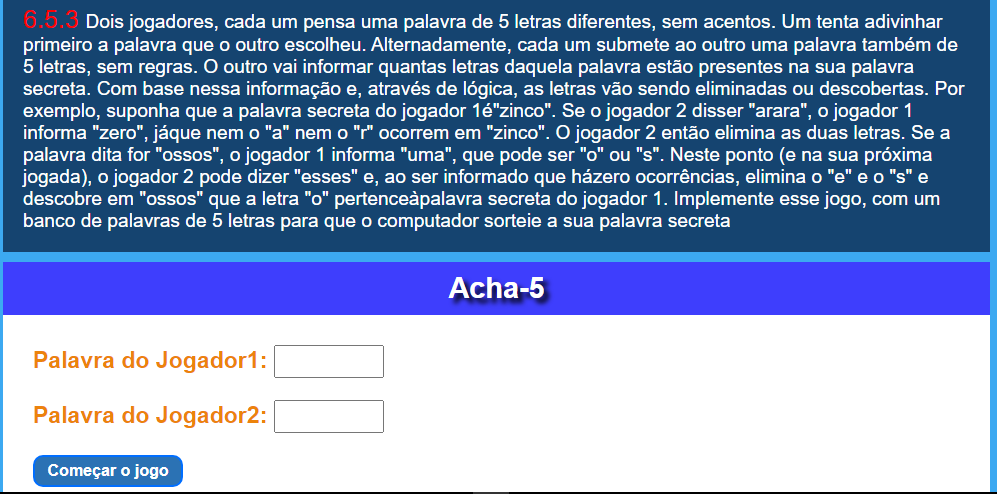
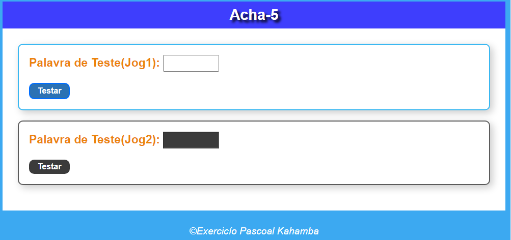
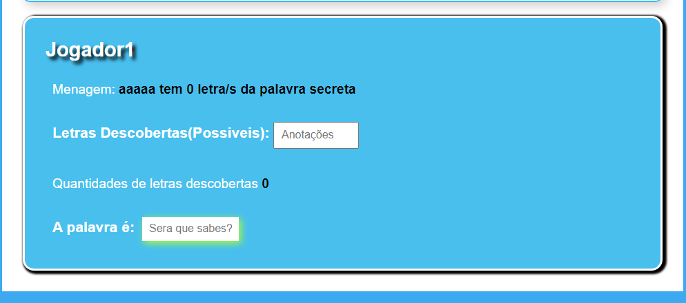
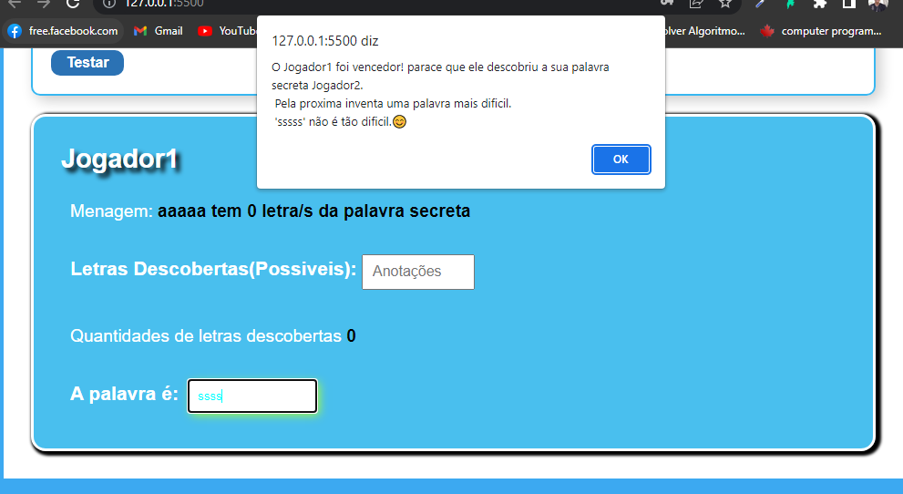

# Projeto Acha5

Este `Projeto` foi desenvolvido para fins de exercicíos com o objetivo de melhorar as minhas `habilidades` em `Javascript`. Este projeto tem a função de achar palavras `secretas` de `Jogadores`, então ao iniciar o projeto ele começa pedindo palavras secretas de dois jogadores de lembrar que os `campos` devem ser preenchidos e os caracteres tem que ter no `no minimo 5` se não vai gerar uma mensagem de `Erro`, se os dados estiverem nos conformes o `layout` do projeto vai mudar pedindo agora que o jogador1 pense numa palavra secreta que supostamente é a palavra secreta do jogador2 assim que ele `clicar no botão de teste`.

O projeto vai `retornar` abaixo uma tela de `resultados` com nome dele a palavra que ele digitou e o numero `de letras` descobertas na palavra secreta do jogador2 e um campo de anotações onde o jogador pode colocar as letras que ele acha que `existe` na palavra secreta do `adiversário` e no fim vem um campo com o nome `A palavra é` onde o jogador com base nos dados obtidos pode colocar a palavra secreta do seu adiversário e quando é digitada a palavra secreta verifique a `borda do campo` se ficar `vermelha` assim a palavra digitada esta `errada` se estiver `certa` o projeto vai `reiniciar` caso não vai ser a vez do jogador2 tentar a sua sorte e pensar na palavra secreta do jogador1.

## Tecnologias

As seguintes ferramentas foram usadas na constuição deste projeto:

- HTML
- CSS
- JAVASCRIPT

#

Feito por ❤ Pascoal Kahamba meu [Linkedin](https://www.linkedin.com/in/pascoal-kahamba-7b43bb233?lipi=urn%3Ali%3Apage%3Ad_flagship3_profile_view_base_contact_details%3BTg8LEKayToyytOX1pVAQ%2Bg%3D%3D)

[👉Clique aqui para rodar o projeto👈](https://projeto-acha5.vercel.app/)😎
